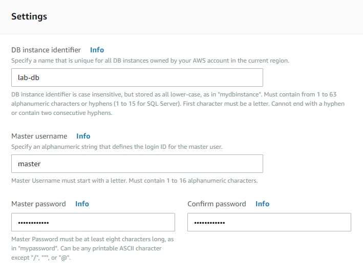
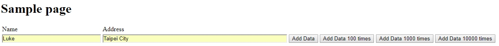

# AWS Read-Replica RDS Database

## Overview
Website and SQL database have been use for long time. In the choice of database, we usually choose MySQL or Oracle database and build it in the ground environment. Now, Amazon has developed RDS's relational database for all AWS users to easily set up operations and extend the associated database in the cloud, from requesting the deployment of infrastructure capacity to installing the repository software. It also automates common administrative tasks such as performing backups and patching the software that supports the repository. Backups can be deployed in different Availability Zone. RDS development uses the same code as the general association database and can be used directly with existing code and tools.

<p align="center">
    
</p>

[Amazon RDS](https://aws.amazon.com/rds/) makes it easy to set up, operate, and scale a relational database in the cloud. It provides cost-efficient and resizable capacity while automating time-consuming administration tasks such as hardware provisioning, database setup, patching and backups. It frees you to focus on your applications so you can give them the fast performance, high availability, security and compatibility they need.

Amazon RDS is available on several database instance types - optimized for memory, performance or I/O - and provides you with six familiar database engines to choose from, including Amazon Aurora, PostgreSQL, MySQL, MariaDB, Oracle Database, and SQL Server. You can use the AWS Database Migration Service to easily migrate or replicate your existing databases to Amazon RDS.

## Scenario
In this lab, we will use CloudFormation to setup a VPC with two availiablity zone and four subnets. We'll deploy our website in the EC2 instances in public subnet, and deploy RDS and read-replica data base in private subnet.

## Step by step
### Set up your environment with CloudFormation template.
Use the ClouFormation template to setup your environment.

1. On the **Service** menu, select **CloudFormation**.

2. Select **Create Stack**.

3. In **Choose a template**, choose **Upload a template to Amazon S3**.

4. Select **RDS-Test.yaml** and click **Next**.

5. Input `RDS-Test` in **Stack name**, leave other setting as default, select **Create** .

### Create Database subnet group
Here, we're going to create subnet groups for database

1. On the **Service** menu, click **RDS** and click **Subnet groups** in the left.

2. Select **Create DB Subnet Group** , create a DB subnet group use the followings:

    * Name : `DB-Subnet-Group`
    * Description : `DB Instance Subnet Group`
    * VPC : select `RDS Lab VPC`
    * availiablity zone : `us-east-1a`
    * Subnet : select the one with `10.0.1.0/24` and click **Add subnet**.

3. Now select another subnet and create:

    * availiablity zone : `us-east-1b`
    * Subnet : select the one with `10.0.129.0/24` and click **Add subnet**.

<p align="center">
    
</p>

<p align="center">
    
</p>

### Create RDS Database Instance
This is the most important part of this lab, we're going to create a RDS database for web server. 

1. In the navigation pane, click **Databases** and click **Create Databases**.

2. Select **MySQL** and select **Production - MySQL** in next page.

3. Complete the following settings:

    * DB instance class : `t2.micro`
    * Multi-AZ deployment : `Create replica in different zone`
    * Storage type : `Genaral Perpose(SSD)`
    * Allocated storage : `20` GiB   
    * DB instance identifier : `lab-db`
    * Master username : `master`
    * Master password : `lab-password`
    * Confirm password : `lab-password`

<p align="center">
    
</p>

<p align="center">
    
</p>

4. In the next page, input the following settings:

    * VPC : select `RDS Lab VPC`
    * Subnet group : `db-subnet-group`
    * VPC security groups : `Choose existing VPC security groups`
      Remove the Default and select `DB-Security-Group`
    * Database name : `lab`
    * Deletion protection : discheck the box

When we create a single lab, we can cancel the back ups to make RDS create faster. But now we're using read-replica, so let the back up selection as default.

It will take four or five minutes to create your database, refresh your webpage to check if it is done.

### Create Read-replica database
In this part, we'll create a read-replica database base on the RDS we created before. Read-replica can separate "read" and "write" works in database. It can promote your website running speed. RDS support up to five read-replica, each replica has it own endpoint

1. Click **RDS** on the service menu, and click **database** to check your status.

2. Note your **lab-db** 's **Region & AZ** (It might be us-east-1a or 1b), wait until your **Status** change to **Available** .

<p align="center">
    
</p>

3. Click **Action**, select **Create read-replica**.

4. Leave most settings as default, just edit a little different part:

    * Availability zone : Choose the different AZ, if you are in **1a** then choose **1b**, vice versa.
    * DB instance identifier : `lab-read-replica`

5. Click **Create read replica**.

Wait until the status change to available. If you want to create more read-replica, select **lab-db** then repeat the steps in this part.

### Create your web with EC2 instances
In this part, we'll create two instances in different availiablity zone. Each EC2 has a webpage, but they will connect to the same database.

1. In the **Service** menu, click **EC2** and click **Launch Instance**.

2. Select **Amazon Linux AMI 2018.03.0 (HVM)**.

3. Select **t2.micro** type of instance.

4. In **Configure Instance Details** input the followings:

    * Network : select `RDS Lab VPC`
    * Subnet : select `RDS Public subnet 1`
    * Auto-assign Public IP : `Enable`

5. In **Advanced Details** , input the followings into **User data**:

```
#!/bin/bash
# Install Apache Web Server and PHP 
yum install -y httpd24 php56 php56-mysqlnd
# Create inc folder
mkdir -p /var/www/inc
# Download SamplePage.php
wget https://raw.githubusercontent.com/ecloudvalley/AWS-Read-Replica-RDS-Database/master/SamplePage.php
mv SamplePage.php /var/www/html/
# Turn on web server 
chkconfig httpd on 
service httpd start
```

6. Skip to **Add Tags**, click **Add tag** and input:

    * Key : `Name`
    * Value : `WebServer1`

7. In **Configure Security Group**, select **Select an existing security group** and choose **WebSecurityGroup**.

8. **Review and launch** your instance, select **Select an existing key pair**. Choose your exist key pair or select **Create a new key pair** to create a new key pair.

9. Launch the **second** instance, follow **steps 1 ~ 8** again, but this time we'll change some settings:
      
    In **Configure Instance Details**

    * Change **Subnet** to `RDS Public subnet 2`

    In **Add tags**

    * Change **value** to `WebServer2`

### Connect to your webserver
After create both webserver, you can see Php and MySQL have been installed already. We will connect into webserver and setup database settings. If you have question with connection, please check [Connect to Your Linux Instance](https://docs.aws.amazon.com/AWSEC2/latest/UserGuide/AccessingInstances.html) for more information.

1. Connect to **WebServer1**, use the following command to get into inc folder and create database config:
```
$ cd /var/www/inc
$ sudo nano dbinfo.inc
```

2. Paste the code below:
```
<?php

define('DB_SERVER', 'Endpoint');
define('DB_USERNAME', 'master');
define('DB_PASSWORD', 'lab-password');
define('DB_DATABASE', 'lab');

?>
```
dbinfo.inc is a config of your RDS database, we'll write down the User name, password, databasename and endpoint we create in the front steps。 You can find your endpoint in RDS database page, if you create your database following the steps, then you won't have to change other setings except Endpoint. 

<p align="center">
    
</p>

3. Modify the Endpoint in red mark, change it to **lab-db**'s endpoint:

<p align="center">
    
</p>

4. Press **Ctrl + X** when your are finish, then press **Y** to leave with origin file name.

After finish setup the first database, it's time to setup the second one, make it connect to read-replica database.

5. Connect to **WebServer2**, repeat **step 1** and **2** again.

6. This time, change **Endpoint** to **lab-db-replica**'s endpoint.
   Since RDS supports the construction of multiple read replicas, when creating several read replicas, the individual endpoint addresses should be filled in here.

7. Press **Ctrl + X** when your are finish, then press **Y** to leave with origin file name.

When we created the web server, **SamplePage.php** have been downloaded into your instance. This is the php page we'll visit later. If you wondering about what's inside, visit the file on [Github](https://raw.githubusercontent.com/ecloudvalley/AWS-Read-Replica-RDS-Database/master/SamplePage.php).

### Test your website
Now we're in the last part, it's time to test our website and database.

1. Copy your **WebServer1**'s **Public DNS(IPv4)** and paste it to the browser, add `/SamplePage.php` in the back.

2. you can see there's blank fields for Name and Address, input a group of value and add it to database.

<p align="center">
    
</p>

3. You can input several times, or use the buttons behind to add one hundred, one thousand or ten thousand data into database. It'll take about three minutes to write ten thousand data.

<p align="center">
    
</p>

<p align="center">
    
</p>

4. Back to **RDS** page and check CPU usage.

<p align="center">
    
</p>

Move on to test the second webserver

5. Copy your **WebServer2**'s **Public DNS(IPv4)** and paste it to the browser, add `/SamplePage.php` in the back.

6. You can see the value input in the front steps, then input another group of value.

7. Discover an error message on top of the website, because the second webserver does'nt support write data function.

<p align="center">
    
</p>

You will see the same page as WebServer1, but read-replica database only can let you read your data, you **can't** edit any value on it. 

## Conclusion
After finish this lab, you will learn how to prepare your VPC with CloudFormation. Also you can deploy a RDS database with read-replica and Webserver in different available zone. The most is, you can connect your webserver to your databases, and test the differences between normal database and read-replica database.
